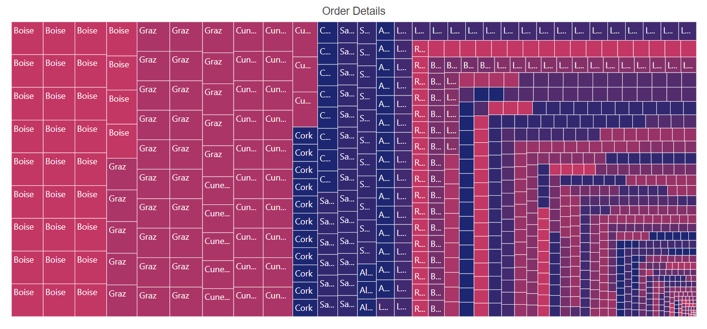

# Data Binding

## Populate data

The [`DataSource`](https://help.syncfusion.com/cr/aspnetcore-blazor/Syncfusion.Blazor~Syncfusion.Blazor.TreeMap.SfTreeMap~DataSource.html) property accepts a collection of values as input. For example, a list of objects can be provided as input. Data can be given as either flat or hierarchical collection to the [`DataSource`](https://help.syncfusion.com/cr/aspnetcore-blazor/Syncfusion.Blazor~Syncfusion.Blazor.TreeMap.SfTreeMap~DataSource.html) property.

### Flat data

The following code example demonstrates how to bind a flat collection as data source to the TreeMap component.

```csharp
@using Syncfusion.Blazor.TreeMap

<SfTreeMap WeightValuePath="GDP" TValue="GDPReport" DataSource="GrowthReports">
    <TreeMapLeafItemSettings LabelPath="Country">
    </TreeMapLeafItemSettings>
</SfTreeMap>

@code {
    public class GDPReport
    {
        public string Country;
        public double GDP;
        public double Percentage;
        public double Rank;
    };

    private List<GDPReport> GrowthReports = new List<GDPReport> {
        new GDPReport {Country = "United States", GDP=17946, Percentage=11.08, Rank=1},
        new GDPReport {Country="China", GDP=10866, Percentage= 28.42, Rank=2},
        new GDPReport {Country="Japan", GDP=4123, Percentage=-30.78, Rank=3},
        new GDPReport {Country="Germany", GDP=3355, Percentage=-5.19, Rank=4},
        new GDPReport {Country="United Kingdom", GDP=2848, Percentage=8.28, Rank=5},
        new GDPReport {Country="France", GDP=2421, Percentage=-9.69, Rank=6},
        new GDPReport {Country="India", GDP=2073, Percentage=13.65, Rank=7},
        new GDPReport {Country="Italy", GDP=1814, Percentage=-12.45, Rank=8},
        new GDPReport {Country="Brazil", GDP=1774, Percentage=-27.88, Rank=9},
        new GDPReport {Country="Canada", GDP=1550, Percentage=-15.02, Rank=10}
    };
}
```


### Hierarchical data

The following code example demonstrates how to bind a hierarchical collection as data source to the TreeMap component.

```csharp
@using Syncfusion.Blazor.TreeMap

<SfTreeMap WeightValuePath="Population" DataSource="PopulationReport">
    <TreeMapLeafItemSettings LabelPath="Name" Fill="#0077b3">
        <TreeMapLeafBorder Width="0.5" Color="black"></TreeMapLeafBorder>
    </TreeMapLeafItemSettings>
    <TreeMapLevels>
        <TreeMapLevel GroupPath="Continent" Fill="#004466">
            <TreeMapLevelBorder Width="0.5" Color="black"></TreeMapLevelBorder>
        </TreeMapLevel>
        <TreeMapLevel GroupPath="States" Fill="#0099e6">
            <TreeMapLevelBorder Width="0.5" Color="black"></TreeMapLevelBorder>
        </TreeMapLevel>
    </TreeMapLevels>
</SfTreeMap>

@code  {
    private List<object> PopulationReport { get; set; } = new List<object> {
        new {
            Continent =  new List<object> { new {
            Name= "Africa",
            Population= 1216130000,
            States= new List<object> { new {
                Name= "Eastern Africa",
                Population= 410637987,
                Region= new List<object> { new {
                    Name= "Ethiopia",
                    Population= 107534882
                 }}
             },
            new {
                Name= "Middle Africa",
                Population= 158562976,
                Region= new List<object>{ new {
                     Name= "Democratic, Republic of the Congo",
                     Population= 84004989
                 }}
                 }
             }
         }}
     },
    new {
         Continent= new List<object> { new {
             Name= "Asia",
             Population= 4436224000,
             States= new List<object> { new {
                     Name= "Central Asia",
                     Population= 69787760,
                     Region= new List<object> { new {
                         Name= "Uzbekistan",
                         Population= 32364996
                     }}
                 },
                 new {
                     Name= "Eastern Asia",
                     Population= 1641908531,
                     Region= new List<object> { new {
                         Name= "China",
                         Population= 1415045928
                     }}
                 }
             }
         }}
     },
     new {
         Continent= new List<object> { new {
             Name= "North America",
             Population= 579024000,
             States= new List<object> { new {
                     Name= "Central America",
                     Population= 174988756,
                     Region= new List<object> { new {
                         Name= "Mexico",
                         Population= 130759074
                     }}
                 },
                 new {
                     Name= "Northern America",
                     Population= 358593810,
                     Region= new List<object> { new {
                         Name= "U.S.",
                         Population= 3267667480
                     }}
                 }
             }
         }}
     },
     new {
         Continent= new List<object> { new {
             Name= "South America",
             Population= 422535000,
             States= new List<object> { new {
                 Name= "Brazil",
                 Population= 204519000
             }}
         }}
     },
     new {
         Continent= new List<object> { new {
             Name= "Europe",
             Population= 738849000,
             States= new List<object> { new {
                     Name= "Eastern Europe",
                     Population= 291953328,
                     Region= new List<object> { new {
                         Name= "Russia",
                         Population= 143964709
                     }}
                 },
                 new {
                     Name= "Northern Europe",
                     Population= 103642971,
                     Region= new List<object> { new {
                         Name= "United Kingdom",
                         Population= 66573504
                     }}
                 }
             }
         }}
     }
    };
}
```


## Local data

### Fetching data from collection

The following code example demonstrates how to bind a list of objects, that is, a collection, to the TreeMap component as a data source.

```csharp
@using Syncfusion.Blazor.TreeMap

<SfTreeMap DataSource="GrowthReports"
           TValue="GDPReport" Palette="@Palette"
           WeightValuePath="GDP">
    <TreeMapLeafItemSettings LabelPath="CountryName">
        <TreeMapLeafLabelStyle Color="White"></TreeMapLeafLabelStyle>
    </TreeMapLeafItemSettings>
</SfTreeMap>

@code{
    public class GDPReport
    {
        public string CountryName;
        public double GDP;
        public double Percentage;
        public int Rank;
    };
    public string[] Palette = new string[] { "#87CEFA", "#87CEEB"  };
    private List<GDPReport> GrowthReports = new List<GDPReport> {
            new GDPReport {CountryName="United States", GDP=17946, Percentage=11.08, Rank=1},
            new GDPReport {CountryName="China", GDP=10866, Percentage= 28.42, Rank=2},
            new GDPReport {CountryName="Japan", GDP=4123, Percentage=-30.78, Rank=3},
            new GDPReport {CountryName="Germany", GDP=3355, Percentage=-5.19, Rank=4},
            new GDPReport {CountryName="United Kingdom", GDP=2848, Percentage=8.28, Rank=5},
            new GDPReport {CountryName="France", GDP=2421, Percentage=-9.69, Rank=6},
            new GDPReport {CountryName="India", GDP=2073, Percentage=13.65, Rank=7},
            new GDPReport {CountryName="Italy", GDP=1814, Percentage=-12.45, Rank=8},
            new GDPReport {CountryName="Brazil", GDP=1774, Percentage=-27.88, Rank=9},
            new GDPReport {CountryName="Canada", GDP=1550, Percentage=-15.02, Rank=10}
    };
}
```


### Fetching data from JSON file

User can read the JSON file data, convert it to the C# object, and assign it to the [`DataSource`](https://help.syncfusion.com/cr/cref_files/aspnetcore-blazor/Syncfusion.Blazor~Syncfusion.Blazor.TreeMap.SfTreeMap%601~DataSource.html) property of TreeMap component.

The `Http.GetJsonAsync` method is used in the  `OnInitAsync` lifecycle method to load JSON file data. As this is done asynchronously, check whether the corresponding data is available and render the TreeMap component or display the loading statement.

```csharp
@using Syncfusion.Blazor.TreeMap
@inject HttpClient Http;

@if (growthReports == null)
{
    <p><em>Loading TreeMap component...</em></p>
}
else
{
    <SfTreeMap WeightValuePath="GDP" TValue="GDPReport" DataSource="GrowthReports">
        <TreeMapLeafItemSettings LabelPath="State">
        </TreeMapLeafItemSettings>
    </SfTreeMap>
}
@code{
    GDPReport[] growthReports;
    protected override async Task OnInitAsync()
    {
        GrowthReports = await Http.GetJsonAsync<GDPReport[]>("sample-data/product-growth.json");
    }
    class GDPReport
    {
        public string State { get; set; }
        public int GDP { get; set; }
        public double Percentage { get; set; }
        public int Rank { get; set; }
    };
}
```


## Remote data

To interact with remote data source, provide the endpoint [`Url`](https://help.syncfusion.com/cr/cref_files/blazor/Syncfusion.Blazor~Syncfusion.Blazor.DataManager~Url.html) within [`SfDataManager`](https://help.syncfusion.com/cr/blazor/Syncfusion.Blazor~Syncfusion.Blazor.DataManager.html) class along with appropriate [`Adaptor`](https://blazor.syncfusion.com/documentation/data/adaptors). By default, [`SfDataManager`](https://help.syncfusion.com/cr/blazor/Syncfusion.Blazor~Syncfusion.Blazor.DataManager.html) uses [`ODataAdaptor`](https://blazor.syncfusion.com/documentation/data/adaptors/#odata-adaptor) for remote data-binding.

> When using [`SfDataManager`](https://help.syncfusion.com/cr/blazor/Syncfusion.Blazor~Syncfusion.Blazor.DataManager.html) for data binding then the **TValue** must be provided explicitly to the treemap component.

### Binding with OData services

[`OData`](https://blazor.syncfusion.com/documentation/data/adaptors/#odata-adaptor) is a standardized protocol for creating and consuming data. User can retrieve data from OData service using the [`SfDataManager`](https://help.syncfusion.com/cr/blazor/Syncfusion.Blazor~Syncfusion.Blazor.DataManager.html) class. Refer to the following code example for remote data binding using OData service.

```csharp
@using Syncfusion.Blazor.TreeMap
@using Syncfusion.Blazor.DropDowns
@using Syncfusion.Blazor.Data

<div class="control-section">
    <div>
        <SfTreeMap TValue="OrderDetails" WeightValuePath="Freight"
                   Palette="@Palette">
            <SfDataManager Url="https://js.syncfusion.com/demos/ejservices/Wcf/Northwind.svc/Orders"
                           Adaptor="Syncfusion.Blazor.Adaptors.ODataAdaptor">
            </SfDataManager>
            <TreeMapTitleSettings Text="Order Details">
            </TreeMapTitleSettings>
            <TreeMapLeafItemSettings LabelPath="ShipCity">
                <TreeMapLeafBorder Color="white" Width="0.5">
                </TreeMapLeafBorder>
            </TreeMapLeafItemSettings>
            <TreeMapTooltipSettings Visible="true"></TreeMapTooltipSettings>
        </SfTreeMap>
    </div>
</div>
@code{
    public string[] Palette = new string[] { "#C33764", "#AB3566", "#993367", "#853169", "#742F6A", "#632D6C", "#532C6D", "#412A6F", "#312870", "#1D2671" };
    public class OrderDetails
    {
        public int OrderID { get; set; }
        public string OrderDate { get; set; }
        public string CustomerID { get; set; }
        public string ShipCity { get; set; }
        public double Freight { get; set; }
    }
}
```

### Binding with OData V4 services

The OData V4 is an improved version of OData protocols, and the [`SfDataManager`](https://help.syncfusion.com/cr/blazor/Syncfusion.Blazor~Syncfusion.Blazor.DataManager.html) class can be used to retrieve and consume OData V4 services. For more details on OData V4 services, refer to the [`OData documentation`](https://blazor.syncfusion.com/documentation/data/adaptors/#odata-adaptor). To bind OData V4 service, use the [`ODataV4Adaptor`](https://blazor.syncfusion.com/documentation/data/adaptors/#odatav4-adaptor).

```csharp
@using Syncfusion.Blazor.TreeMap
@using Syncfusion.Blazor.DropDowns
@using Syncfusion.Blazor.Data

<div class="control-section">
    <div>
        <SfTreeMap TValue="OrderDetails" WeightValuePath="Freight"
                   Palette="@Palette">
            <SfDataManager Url="https://js.syncfusion.com/demos/ejservices/Wcf/Northwind.svc/Orders"
                           Adaptor="Syncfusion.Blazor.Adaptors.ODataV4Adaptor">
            </SfDataManager>
            <TreeMapTitleSettings Text="Order Details">
            </TreeMapTitleSettings>
            <TreeMapLeafItemSettings LabelPath="ShipCity">
                <TreeMapLeafBorder Color="white" Width="0.5">
                </TreeMapLeafBorder>
            </TreeMapLeafItemSettings>
            <TreeMapTooltipSettings Visible="true"></TreeMapTooltipSettings>
        </SfTreeMap>
    </div>
</div>
@code{
    public string[] Palette = new string[] { "#C33764", "#AB3566", "#993367", "#853169", "#742F6A", "#632D6C", "#532C6D", "#412A6F", "#312870", "#1D2671" };
    public class OrderDetails
    {
        public int OrderID { get; set; }
        public string OrderDate { get; set; }
        public string CustomerID { get; set; }
        public string ShipCity { get; set; }
        public double Freight { get; set; }
    }
}
```

### Web API

One can use [`WebApiAdaptor`](https://blazor.syncfusion.com/documentation/data/adaptors/?no-cache=1#web-api-adaptor) to bind treemap with Web API created using OData endpoint.

```csharp
@using Syncfusion.Blazor.TreeMap
@using Syncfusion.Blazor.DropDowns
@using Syncfusion.Blazor.Data

<div class="control-section">
    <div>
        <SfTreeMap TValue="OrderDetails" WeightValuePath="Freight"
                   Palette="@Palette">
            <SfDataManager Url="https://js.syncfusion.com/demos/ejservices/Wcf/Northwind.svc/Orders"
                           Adaptor="Syncfusion.Blazor.Adaptors.WebApiAdaptor">
            </SfDataManager>
            <TreeMapTitleSettings Text="Order Details">
            </TreeMapTitleSettings>
            <TreeMapLeafItemSettings LabelPath="ShipCity">
                <TreeMapLeafBorder Color="white" Width="0.5">
                </TreeMapLeafBorder>
            </TreeMapLeafItemSettings>
            <TreeMapTooltipSettings Visible="true"></TreeMapTooltipSettings>
        </SfTreeMap>
    </div>
</div>
@code{
    public string[] Palette = new string[] { "#C33764", "#AB3566", "#993367", "#853169", "#742F6A", "#632D6C", "#532C6D", "#412A6F", "#312870", "#1D2671" };
    public class OrderDetails
    {
        public int OrderID { get; set; }
        public string OrderDate { get; set; }
        public string CustomerID { get; set; }
        public string ShipCity { get; set; }
        public double Freight { get; set; }
    }
}
```



## Entity Framework

Entity Framework acts as a modern object-database mapper for .NET. This section explains how to consume data from the **Microsoft SQL Server** database and bind it to the treemap component.

### Create DBContext class

The first step is to create a DBContext class called **OrderContext** for establishing connection to a Microsoft SQL Server database.

```csharp
    using Microsoft.EntityFrameworkCore;
    using System;
    using System.Collections.Generic;
    using System.Linq;
    using System.Threading.Tasks;
    using EFTreeMap.Data;

    namespace EFTreeMap.Data
    {
        public class OrderContext : DbContext
        {
            public virtual DbSet<Order> Orders { get; set; }

            protected override void OnConfiguring(DbContextOptionsBuilder optionsBuilder)
            {
                if (!optionsBuilder.IsConfigured)
                {
                    // Configures the context to connect to a Microsoft SQL Serve database
                    optionsBuilder.UseSqlServer(@"Data Source=(LocalDB)\MSSQLLocalDB;AttachDbFilename='D:\blazor\EFTreeMap\App_Data\NORTHWND.MDF';Integrated Security=True;Connect Timeout=30");
                }
            }
        }

        public class Order
        {
            [Key]
            public int? OrderID { get; set; }
            [Required]
            public string CustomerID { get; set; }
            [Required]
            public int EmployeeID { get; set; }
        }
    }

```

### Create data access layer to perform data operation

Now need to create a class called **OrderDataAccessLayer**, which acts as a data access layer to retrieve the records from the database table.

```csharp
    using Microsoft.EntityFrameworkCore;
    using System;
    using System.Collections.Generic;
    using System.Linq;
    using System.Threading.Tasks;
    using EFTreeMap.Data;

    namespace EFTreeMap.Data
    {
        public class OrderDataAccessLayer
        {
            OrderContext db = new OrderContext();

            //To Get all Orders details
            public DbSet<Order> GetAllOrders()
            {
                try
                {
                    return db.Orders;
                }
                catch
                {
                    throw;
                }
            }
        }
    }

```

### Creating Web API Controller

A Web API Controller must be created which allows the treemap to directly consume data from the Entity framework.

```csharp
    using System;
    using System.Collections;
    using System.Collections.Generic;
    using System.Linq;
    using System.Threading.Tasks;
    using Microsoft.AspNetCore.Http;
    using Microsoft.AspNetCore.Mvc;
    using Microsoft.Extensions.Primitives;
    using EFTreeMap.Data;

    namespace EFTreeMap.Controller
    {
        [Route("api/[controller]")]
        [ApiController]
        public class DefaultController : ControllerBase
        {
            OrderDataAccessLayer db = new OrderDataAccessLayer();
            [HttpGet]
            public object Get()
            {
                IQueryable<Order> data = db.GetAllOrders().AsQueryable();
                var count = data.Count();
                var queryString = Request.Query;
                if (queryString.Keys.Contains("$inlinecount"))
                {
                    StringValues Skip;
                    StringValues Take;
                    int skip = (queryString.TryGetValue("$skip", out Skip)) ? Convert.ToInt32(Skip[0]) : 0;
                    int top = (queryString.TryGetValue("$top", out Take)) ? Convert.ToInt32(Take[0]) : data.Count();
                    return new { Items = data.Skip(skip).Take(top), Count = count };
                }
                else
                {
                    return data;
                }
            }
        }
    }

```

### Add Web API Controller services in Startup.cs

Open the **Startup.cs** file and add services and endpoints required for Web API Controller as follows.

```csharp
using Newtonsoft.Json.Serialization;

namespace BlazorApplication
{
    public class Startup
    {
        ....
        ....
        public void ConfigureServices(IServiceCollection services)
        {
            ....
            ....
            services.AddSingleton<OrderDataAccessLayer>();

            // Adds services for controllers to the specified Microsoft.Extensions.DependencyInjection.IServiceCollection.
            services.AddControllers().AddNewtonsoftJson(options =>
            {
                options.SerializerSettings.ContractResolver = new DefaultContractResolver();
            });
        }

        public void Configure(IApplicationBuilder app, IWebHostEnvironment env)
        {
            ....
            ....
            app.UseEndpoints(endpoints =>
            {
                // Adds endpoints for controller actions to the Microsoft.AspNetCore.Routing.IEndpointRouteBuilder
                endpoints.MapDefaultControllerRoute();
                .....
                .....
            });
        }
    }
}
```

### Configure treemap component

Configure the treemap to bind data using either [`DataSource`](https://help.syncfusion.com/cr/aspnetcore-blazor/Syncfusion.Blazor~Syncfusion.Blazor.TreeMap.SfTreeMap~DataSource.html) property or [`SfDataManager`](https://help.syncfusion.com/cr/blazor/Syncfusion.Blazor~Syncfusion.Blazor.DataManager.html).

For instance, to bind data directly from the data access layer class **OrderDataAccessLayer**, assign the [`DataSource`](https://help.syncfusion.com/cr/aspnetcore-blazor/Syncfusion.Blazor~Syncfusion.Blazor.TreeMap.SfTreeMap~DataSource.html) property to be **OrderData.GetAllOrders()**.

```csharp

    @inject OrderDataAccessLayer OrderData

    @using EFTreeMap.Data
    @using Syncfusion.Blazor.TreeMap

    <SfTreeMap TValue="Order" WeightValuePath="OrderID"
                   Palette="@Palette" DataSource="@OrderData.GetAllOrders()">
            <TreeMapTitleSettings Text="Order Details">
            </TreeMapTitleSettings>
            <TreeMapLeafItemSettings LabelPath="CustomerID">
                <TreeMapLeafBorder Color="white" Width="0.5">
                </TreeMapLeafBorder>
            </TreeMapLeafItemSettings>
            <TreeMapTooltipSettings Visible="true"></TreeMapTooltipSettings>
    </SfTreeMap>
    @code{
        public string[] Palette = new string[] { "#C33764", "#AB3566", "#993367", "#853169", "#742F6A", "#632D6C", "#532C6D", "#412A6F", "#312870", "#1D2671" };
    }
```

On the other hand, to configure the treemap using Web API, provide the appropriate endpoint Url within [`SfDataManager`](https://help.syncfusion.com/cr/blazor/Syncfusion.Blazor~Syncfusion.Blazor.DataManager.html) along with [`Adaptor`](https://blazor.syncfusion.com/documentation/data/adaptors). Here, need to use [`WebApiAdaptor`](https://blazor.syncfusion.com/documentation/data/adaptors/?no-cache=1#web-api-adaptor) in-order to interact with the Web API to consume data from the entity framework appropriately.

```csharp
@using Syncfusion.Blazor.TreeMap
@using Syncfusion.Blazor.DropDowns
@using Syncfusion.Blazor.Data

<div class="control-section">
    <div>
        <SfTreeMap TValue="Order" WeightValuePath="OrderID"
                   Palette="@Palette">
            <SfDataManager Url="api/Default" Adaptor="Syncfusion.Blazor.Adaptors.WebApiAdaptor">
            </SfDataManager>
            <TreeMapTitleSettings Text="Order Details">
            </TreeMapTitleSettings>
            <TreeMapLeafItemSettings LabelPath="CustomerID">
                <TreeMapLeafBorder Color="white" Width="0.5">
                </TreeMapLeafBorder>
            </TreeMapLeafItemSettings>
            <TreeMapTooltipSettings Visible="true"></TreeMapTooltipSettings>
        </SfTreeMap>
    </div>
</div>
@code{
    public string[] Palette = new string[] { "#C33764", "#AB3566", "#993367", "#853169", "#742F6A", "#632D6C", "#532C6D", "#412A6F", "#312870", "#1D2671" };
}
```