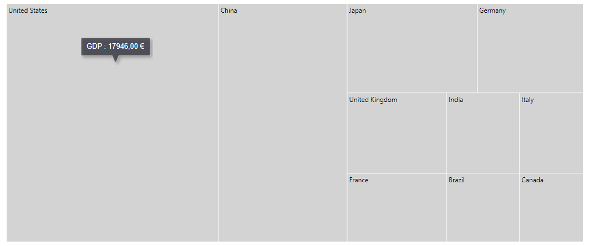

# Internationalization

The TreeMap component supports internationalization for the following elements:

* Data label
* Tooltip

<!-- markdownlint-disable MD036 -->

**Globalization**

Globalization is the process of designing and developing a component that works in different cultures/locales. Internationalization library is used to globalize number, date, and time values in the TreeMap component using the `Format` property in the TreeMap model.

**Numeric format**

In the following code example, tooltip is globalized to Deutsch culture.

```csharp
<SfTreeMap WeightValuePath="GDP" DataSource="GrowthReports" Format="c">
    <TreeMapTooltipSettings Visible=true>
    </TreeMapTooltipSettings>
</SfTreeMap>

@code {
    public class GDPReport
    {
        public string State;
        public double GDP;
        public double Percentage;
        public int Rank;
    };

    private List<GDPReport> GrowthReports = new List<GDPReport> {
            new GDPReport {State="United States", GDP=17946, Percentage=11.08, Rank=1},
            new GDPReport {State="China", GDP=10866, Percentage= 28.42, Rank=2},
            new GDPReport {State="Japan", GDP=4123, Percentage=-30.78, Rank=3},
            new GDPReport {State="Germany", GDP=3355, Percentage=-5.19, Rank=4},
            new GDPReport {State="United Kingdom", GDP=2848, Percentage=8.28, Rank=5},
            new GDPReport {State="France", GDP=2421, Percentage=-9.69, Rank=6},
            new GDPReport {State="India", GDP=2073, Percentage=13.65, Rank=7},
            new GDPReport {State="Italy", GDP=1814, Percentage=-12.45, Rank=8},
            new GDPReport {State="Brazil", GDP=1774, Percentage=-27.88, Rank=9},
            new GDPReport {State="Canada", GDP=1550, Percentage=-15.02, Rank=10}
    };
    [Inject]
    protected IJSRuntime JsRuntime { get; set; }
    protected override void OnAfterRender()
    {
        this.JsRuntime.Sf().LoadCldrData(new string[]{"ca-gregorian.json",
         "currencies.json","numbers.json","timeZoneNames.json"}).SetCulture("de");
    }
}
```



## Right-to-left rendering

The TreeMap component supports right-to-left rendering for all its elements such as nodes, tooltip, data labels, and legends.

## Legend with Rtl support

If you set the `EnableRtl` property to true, then the legend icon will be rendered on the right and the legend text will be rendered on the left of the legend icon.

```csharp
<SfTreeMap DataSource="Cars"
            WeightValuePath="Count"
            ColorValuePath="Color"
            EnableRtl="true">
    <TreeMapLeafItemSettings LabelPath="Name">
    </TreeMapLeafItemSettings>
    <TreeMapLegendSettings Visible="true"
                           Position="LegendPosition.Top">
    </TreeMapLegendSettings>
</SfTreeMap>

@code {
    public class Car
    {
        public string Name;
        public string Brand;
        public int Count;
        public string Color;
    };
    private List<Car> Cars = new List<Car> {
        new Car { Name="Mustang", Brand="Ford", Count=232, Color= "#71B081" },
        new Car { Name="EcoSport", Brand="Ford", Count=121,  Color= "#5A9A77" },
        new Car { Name="Swift", Brand="Maruti", Count=143, Color= "#498770" },
        new Car { Name="Baleno", Brand="Maruti", Count=454, Color= "#39776C" },
        new Car { Name="Vitara Brezza", Brand="Maruti", Count=545 , Color= "#266665" },
        new Car { Name="A3 Cabriolet", Brand="Audi",Count=123, Color= "#124F5E" }
    };
    [Inject]
    protected IJSRuntime JsRuntime { get; set; }

    protected override void OnAfterRender()
    {
        this.JsRuntime Sf().EnableRtl(true);
    }
}
```


## TreeMap Item Rendering Direction

By default, the direction of TreeMap item is `TopLeftBottomRight`. You can customize the rendering direction of the TreeMap item by setting the `RenderDirection` property.

The TreeMap can be rendered in the following four different directions.
      `TopLeftBottomRight`
      `TopRightBottomLeft`
      `BottomRightTopLeft`
      `BottomLeftTopRight`

The following example demonstrate how to render the TreeMap in the RTL direction with `TopLeftBottomRight`.

```csharp
<SfTreeMap DataSource="Fruits"
            WeightValuePath="Count"
            Palette='new string[]{"#71B081","#5A9A77", "#498770", "#39776C", "#266665","#124F5E"}'
            RenderDirection="RenderingMode.TopLeftBottomRight">
    <TreeMapLeafItemSettings LabelPath="Name">
    </TreeMapLeafItemSettings>
    <TreeMapTooltipSettings Visible=true Format="${Count} : ${Name}">
    </TreeMapTooltipSettings>
</SfTreeMap>

@code{
    public class Fruit
    {
        public string Name;
        public int Count;
    };
    private List<Fruit> Fruits = new List<Fruit> {
        new Fruit { Name="Apple", Count=5000 },
        new Fruit { Name="Mango", Count=3000 },
        new Fruit { Name="Orange", Count=2300 },
        new Fruit { Name="Banana", Count=500 },
        new Fruit { Name="Grape", Count=4300 },
        new Fruit { Name="Papaya", Count=1200 },
        new Fruit { Name="Melon", Count=4500 }
    };
}
```


The following example demonstrate how to render the TreeMap in the RTL direction with `TopRightBottomLeft`.

```csharp
<SfTreeMap DataSource="Fruits"
            WeightValuePath="Count"
            Palette='new string[]{"#71B081","#5A9A77", "#498770", "#39776C", "#266665","#124F5E"}'
            RenderDirection="RenderingMode.TopRightBottomLeft">
    <TreeMapLeafItemSettings LabelPath="Name">
    </TreeMapLeafItemSettings>
    <TreeMapTooltipSettings Visible=true Format="${Count} : ${Name}">
    </TreeMapTooltipSettings>
</SfTreeMap>

@code{
    public class Fruit
    {
        public string Name;
        public int Count;
    };
    private List<Fruit> Fruits = new List<Fruit> {
        new Fruit { Name="Apple", Count=5000 },
        new Fruit { Name="Mango", Count=3000 },
        new Fruit { Name="Orange", Count=2300 },
        new Fruit { Name="Banana", Count=500 },
        new Fruit { Name="Grape", Count=4300 },
        new Fruit { Name="Papaya", Count=1200 },
        new Fruit { Name="Melon", Count=4500 }
    };
}
```


The following example demonstrate how to render the TreeMap in the RTL direction with `BottomRightTopLeft`.

```csharp
<SfTreeMap DataSource="Fruits"
            WeightValuePath="Count"
            Palette='new string[]{"#71B081","#5A9A77", "#498770", "#39776C", "#266665","#124F5E"}'
            RenderDirection="RenderingMode.BottomRightTopLeft">
    <TreeMapLeafItemSettings LabelPath="Name">
    </TreeMapLeafItemSettings>
    <TreeMapTooltipSettings Visible=true Format="${Count} : ${Name}">
    </TreeMapTooltipSettings>
</SfTreeMap>

@code{
    public class Fruit
    {
        public string Name;
        public int Count;
    };
    private List<Fruit> Fruits = new List<Fruit> {
        new Fruit { Name="Apple", Count=5000 },
        new Fruit { Name="Mango", Count=3000 },
        new Fruit { Name="Orange", Count=2300 },
        new Fruit { Name="Banana", Count=500 },
        new Fruit { Name="Grape", Count=4300 },
        new Fruit { Name="Papaya", Count=1200 },
        new Fruit { Name="Melon", Count=4500 }
    };
}
```


The following example demonstrate how to render the TreeMap in the RTL direction with `BottomLeftTopRight`.

```csharp
<SfTreeMap DataSource="Fruits"
            WeightValuePath="Count"
            Palette='new string[]{"#71B081","#5A9A77", "#498770", "#39776C", "#266665","#124F5E"}'
            RenderDirection="RenderingMode.BottomLeftTopRight">
    <TreeMapLeafItemSettings LabelPath="Name">
    </TreeMapLeafItemSettings>
    <TreeMapTooltipSettings Visible=true Format="${Count} : ${Name}">
    </TreeMapTooltipSettings>
</SfTreeMap>

@code{
    public class Fruit
    {
        public string Name;
        public int Count;
    };
    private List<Fruit> Fruits = new List<Fruit> {
        new Fruit { Name="Apple", Count=5000 },
        new Fruit { Name="Mango", Count=3000 },
        new Fruit { Name="Orange", Count=2300 },
        new Fruit { Name="Banana", Count=500 },
        new Fruit { Name="Grape", Count=4300 },
        new Fruit { Name="Papaya", Count=1200 },
        new Fruit { Name="Melon", Count=4500 }
    };
}
```

