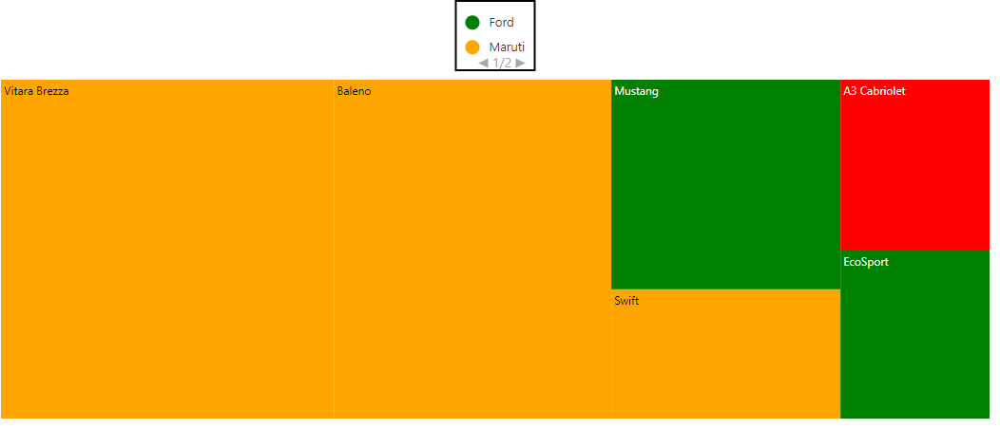
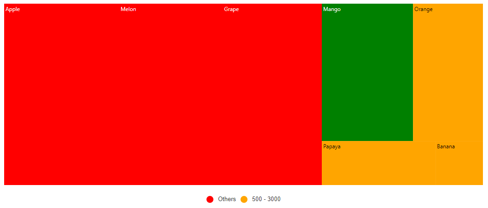
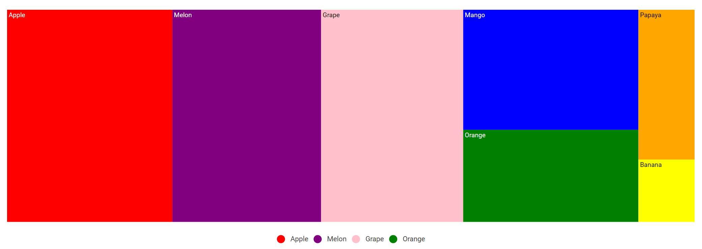
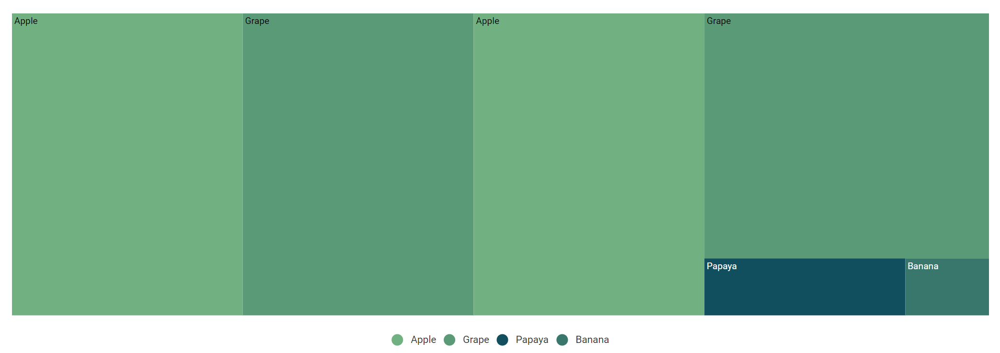

# Legend

A legend is used to provide valuable information for interpreting what the TreeMap displays. The legends can be represented in various colors, shapes, or other identifiers based on data.

## Types of legend

The TreeMap component supports two different types of legend rendering modes [`Default`](https://help.syncfusion.com/cr/aspnetcore-blazor/Syncfusion.Blazor~Syncfusion.Blazor.TreeMap.LegendMode.html) and [`Interactive`](https://help.syncfusion.com/cr/aspnetcore-blazor/Syncfusion.Blazor~Syncfusion.Blazor.TreeMap.LegendMode.html).

### Default legend

In the default mode, the legends have symbols with legend labels that are used to identify the items in the TreeMap component.

The following code example demonstrates the default mode of legends.

```csharp
@using Syncfusion.Blazor.TreeMap

<SfTreeMap DataSource="Cars"
            TValue="Car"
            WeightValuePath="Count"
            EqualColorValuePath="Brand">
    <TreeMapLeafItemSettings LabelPath="Name">
         <TreeMapLeafColorMappings>
            <TreeMapLeafColorMapping Value="Ford" Color="@("green")"></TreeMapLeafColorMapping>
            <TreeMapLeafColorMapping Value="Audi" Color="@("red")"></TreeMapLeafColorMapping>
            <TreeMapLeafColorMapping Value="Maruti"  Color="@("orange")"></TreeMapLeafColorMapping>
        </TreeMapLeafColorMappings>
    </TreeMapLeafItemSettings>
    <TreeMapLegendSettings Visible="true"
                           Position="LegendPosition.Top">
    </TreeMapLegendSettings>
</SfTreeMap>

@code {
    public class Car
    {
        public string Name;
        public string Brand;
        public int Count;
    };
    private List<Car> Cars = new List<Car> {
        new Car { Name="Mustang", Brand="Ford", Count=232},
        new Car { Name="EcoSport", Brand="Ford", Count=121},
        new Car { Name="Swift", Brand="Maruti", Count=143},
        new Car { Name="Baleno", Brand="Maruti", Count=454},
        new Car { Name="Vitara Brezza", Brand="Maruti", Count=545},
        new Car { Name="A3 Cabriolet", Brand="Audi", Count=123}
    };
}
```


### Interactive legend

The legends can be made interactive with an arrow mark that indicates exact range color in legend when the mouse hovers over the corresponding shape. You can enable this option by setting the values of mode property in legendSettings to [`Interactive`](https://help.syncfusion.com/cr/aspnetcore-blazor/Syncfusion.Blazor~Syncfusion.Blazor.TreeMap.LegendMode.html). The default value of the mode property is [`Default`](https://help.syncfusion.com/cr/aspnetcore-blazor/Syncfusion.Blazor~Syncfusion.Blazor.TreeMap.LegendMode.html) to enable normal legend.

The following code example demonstrates the interactive mode of legends.

```csharp
@using Syncfusion.Blazor.TreeMap

<SfTreeMap DataSource="Cars"
            TValue="Car"
            WeightValuePath="Count"
            EqualColorValuePath="Brand">
    <TreeMapLeafItemSettings LabelPath="Name">
        <TreeMapLeafColorMappings>
            <TreeMapLeafColorMapping Value="Ford" Color="@("green")"></TreeMapLeafColorMapping>
            <TreeMapLeafColorMapping Value="Audi" Color="@("red")"></TreeMapLeafColorMapping>
            <TreeMapLeafColorMapping Value="Maruti"  Color="@("orange")"></TreeMapLeafColorMapping>
        </TreeMapLeafColorMappings>
    </TreeMapLeafItemSettings>
    <TreeMapLegendSettings Visible="true"
                           Mode="LegendMode.Interactive"
                           Shape="LegendShape.Rectangle"
                           Position="LegendPosition.Top">
    </TreeMapLegendSettings>
</SfTreeMap>
@code {
    public class Car
    {
        public string Name;
        public string Brand;
        public int Count;
    };
    private List<Car> Cars = new List<Car> {
        new Car { Name="Mustang", Brand="Ford", Count=232},
        new Car { Name="EcoSport", Brand="Ford", Count=121},
        new Car { Name="Swift", Brand="Maruti", Count=143},
        new Car { Name="Baleno", Brand="Maruti", Count=454},
        new Car { Name="Vitara Brezza", Brand="Maruti", Count=545},
        new Car { Name="A3 Cabriolet", Brand="Audi", Count=123},
        new Car { Name="RS7 Sportback", Brand="Audi", Count=523 }
    };
}
```


## Position and alignment

The legend position is used to place legend in various positions. Based on the legend position, the legend item will be aligned. For example, if the position is [`Top`](https://help.syncfusion.com/cr/aspnetcore-blazor/Syncfusion.Blazor~Syncfusion.Blazor.TreeMap.LegendPosition.html) or [`Bottom`](https://help.syncfusion.com/cr/aspnetcore-blazor/Syncfusion.Blazor~Syncfusion.Blazor.TreeMap.LegendPosition.html), the legend items are placed by rows. If the position is [`Left`](https://help.syncfusion.com/cr/aspnetcore-blazor/Syncfusion.Blazor~Syncfusion.Blazor.TreeMap.LegendPosition.html) or [`Right`](https://help.syncfusion.com/cr/aspnetcore-blazor/Syncfusion.Blazor~Syncfusion.Blazor.TreeMap.LegendPosition.html), the legend items are placed by columns.

The following options are available to customize the legend position:

* Top
* Bottom
* Left
* Right
* Float

The following code example demonstrates the legend position.

```csharp
@using Syncfusion.Blazor.TreeMap

<SfTreeMap DataSource="Fruits" TValue="Fruit" WeightValuePath="Count" RangeColorValuePath="Count">
    <TreeMapLeafItemSettings LabelPath="FruitName">
        <TreeMapLeafColorMappings>
            <TreeMapLeafColorMapping From="500" To="3000" Color="@("Orange")"></TreeMapLeafColorMapping>
            <TreeMapLeafColorMapping From="3000" To="5000" Color="@("Green")"></TreeMapLeafColorMapping>
        </TreeMapLeafColorMappings>
    </TreeMapLeafItemSettings>
    <TreeMapLegendSettings Visible="true" Position="LegendPosition.Top"></TreeMapLegendSettings>
</SfTreeMap>

@code {
    //fruits data source
    public class Fruit
    {
        public string FruitName;
        public double Count;
    };
    private List<Fruit> Fruits = new List<Fruit> {
        new Fruit { FruitName="Apple", Count=5000 },
        new Fruit { FruitName="Mango", Count=3000 },
        new Fruit { FruitName="Orange", Count=2300 },
        new Fruit { FruitName="Banana", Count=500 },
        new Fruit { FruitName="Grape", Count=4300 },
        new Fruit { FruitName="Papaya", Count=1200 },
        new Fruit { FruitName="Melon", Count=4500 }
    };
}
```


The legend alignment is used to align the legend items in specific location. The following options are available to customize the legend alignment:

* Near
* Center
* Far

The following code example demonstrates legend alignment.

```csharp
@using Syncfusion.Blazor.TreeMap

<SfTreeMap DataSource="Fruits"
            TValue="Fruit"
            WeightValuePath="Count"
            RangeColorValuePath="Count">
    <TreeMapLeafItemSettings LabelPath="FruitName">
         <TreeMapLeafColorMappings>
            <TreeMapLeafColorMapping From="500" To="3000" Color="@("Orange")"></TreeMapLeafColorMapping>
            <TreeMapLeafColorMapping From="3000" To="5000" Color="@("Green")"></TreeMapLeafColorMapping>
        </TreeMapLeafColorMappings>
    </TreeMapLeafItemSettings>
    <TreeMapLegendSettings Visible="true"
                           Alignment="Alignment.Far">
    </TreeMapLegendSettings>
</SfTreeMap>

@code {
    //fruits data source
    public class Fruit
    {
        public string FruitName;
        public double Count;
    };
    private List<Fruit> Fruits = new List<Fruit> {
        new Fruit { FruitName="Apple", Count=5000 },
        new Fruit { FruitName="Mango", Count=3000 },
        new Fruit { FruitName="Orange", Count=2300 },
        new Fruit { FruitName="Banana", Count=500 },
        new Fruit { FruitName="Grape", Count=4300 },
        new Fruit { FruitName="Papaya", Count=1200 },
        new Fruit { FruitName="Melon", Count=4500 }
    };
}
```


## Legend size

You can customize the legend size by modifying the [`Height`](https://help.syncfusion.com/cr/aspnetcore-blazor/Syncfusion.Blazor~Syncfusion.Blazor.TreeMap.LegendSettingsModel~Height.html) and [`Width`](https://help.syncfusion.com/cr/aspnetcore-blazor/Syncfusion.Blazor~Syncfusion.Blazor.TreeMap.LegendSettingsModel~Width.html) properties in [`TreeMapLegendSettings`](https://help.syncfusion.com/cr/aspnetcore-blazor/Syncfusion.Blazor~Syncfusion.Blazor.TreeMap.LegendSettingsModel_members.html). It accepts values in both percentage and pixel. If the value is specified in percentage for height or width, the legend height will be calculated for overall height.

Legend size is shown in the following example.

```csharp
@using Syncfusion.Blazor.TreeMap

<SfTreeMap DataSource="Cars"
            WeightValuePath="Count"
            EqualColorValuePath="Brand">
    <TreeMapLeafItemSettings LabelPath="Name">
        <TreeMapLeafColorMappings>
            <TreeMapLeafColorMapping Value="Ford" Color="@("green")"></TreeMapLeafColorMapping>
            <TreeMapLeafColorMapping Value="Audi" Color="@("red")"></TreeMapLeafColorMapping>
            <TreeMapLeafColorMapping Value="Maruti"  Color="@("orange")"></TreeMapLeafColorMapping>
        </TreeMapLeafColorMappings>
    </TreeMapLeafItemSettings>
    <TreeMapLegendSettings Visible="true"
                           Height="50px"
                           Width="200px"
                           Position="LegendPosition.Top">
    </TreeMapLegendSettings>
</SfTreeMap>
@code {
    public class Car
    {
        public string Name;
        public string Brand;
        public int Count;
    };
    private List<Car> Cars = new List<Car> {
        new Car { Name="Mustang", Brand="Ford", Count=232},
        new Car { Name="EcoSport", Brand="Ford", Count=121},
        new Car { Name="Swift", Brand="Maruti", Count=143},
        new Car { Name="Baleno", Brand="Maruti", Count=454},
        new Car { Name="Vitara Brezza", Brand="Maruti", Count=545},
        new Car { Name="A3 Cabriolet", Brand="Audi", Count=123},
        new Car { Name="RS7 Sportback", Brand="Audi", Count=523 }
    };
}
```


### Legend with paging support

The TreeMap supports the legend paging. Legend paging will be enabled if the legend items cannot be placed within the  provided height and width.

The following code example demonstrates how to enable the legend paging.

```csharp
@using Syncfusion.Blazor.TreeMap

<SfTreeMap DataSource="Cars"
            TValue="Car"
            WeightValuePath="Count"
            EqualColorValuePath="Brand">
    <TreeMapLeafItemSettings LabelPath="Name">
        <TreeMapLeafColorMappings>
            <TreeMapLeafColorMapping Value="Ford" Color="@("green")"></TreeMapLeafColorMapping>
            <TreeMapLeafColorMapping Value="Audi" Color="@("red")"></TreeMapLeafColorMapping>
            <TreeMapLeafColorMapping Value="Maruti"  Color="@("orange")"></TreeMapLeafColorMapping>
        </TreeMapLeafColorMappings>
    </TreeMapLeafItemSettings>
    <TreeMapLegendSettings Visible="true"
                           Height="50px"
                           Width="100px"
                           Position="LegendPosition.Top">
    </TreeMapLegendSettings>
</SfTreeMap>
@code {
    public class Car
    {
        public string Name;
        public string Brand;
        public int Count;
    };
    private List<Car> Cars = new List<Car> {
        new Car { Name="Mustang", Brand="Ford", Count=232},
        new Car { Name="EcoSport", Brand="Ford", Count=121},
        new Car { Name="Swift", Brand="Maruti", Count=143},
        new Car { Name="Baleno", Brand="Maruti", Count=454},
        new Car { Name="Vitara Brezza", Brand="Maruti", Count=545},
        new Car { Name="A3 Cabriolet", Brand="Audi", Count=123},
        new Car { Name="RS7 Sportback", Brand="Audi", Count=523 }
    };
}
```



## Legend for items excluded from color mapping

Based on the ranges in the data source, get the excluded ranges from color mapping and show the legend with excluded range values are bound to the specific legend.

The following code example demonstrates how to set the color for items excluded from color mapping.

```csharp
@using Syncfusion.Blazor.TreeMap

<SfTreeMap DataSource="Fruits"
            TValue="Fruit"
            WeightValuePath="Count"
            RangeColorValuePath="Count">
    <TreeMapLeafItemSettings LabelPath="FruitName">
        <TreeMapLeafColorMappings>
            <TreeMapLeafColorMapping From="500" To="3000" Color="@("Orange")"></TreeMapLeafColorMapping>
            <TreeMapLeafColorMapping From="3000" To="5000" Color="@("Green")"></TreeMapLeafColorMapping>
            <TreeMapLeafColorMapping Color="@("red")"></TreeMapLeafColorMapping>
        </TreeMapLeafColorMappings>
    </TreeMapLeafItemSettings>
    <TreeMapLegendSettings Visible="true">
    </TreeMapLegendSettings>
</SfTreeMap>

@code {
    //fruits data source
    public class Fruit
    {
        public string FruitName;
        public double Count;
    };
    private List<Fruit> Fruits = new List<Fruit> {
        new Fruit { FruitName="Apple", Count=5000 },
        new Fruit { FruitName="Mango", Count=3000 },
        new Fruit { FruitName="Orange", Count=2300 },
        new Fruit { FruitName="Banana", Count=500 },
        new Fruit { FruitName="Grape", Count=4300 },
        new Fruit { FruitName="Papaya", Count=1200 },
        new Fruit { FruitName="Melon", Count=4500 }
    };
}
```


## Hide desired legend items

To enable or disable the desired legend for each color mapping,set the [`showLegend`](https://help.syncfusion.com/cr/aspnetcore-blazor/Syncfusion.Blazor~Syncfusion.Blazor.TreeMap.TreeMapLegendSettings_members.html) property to [`true`](https://help.syncfusion.com/cr/aspnetcore-blazor/Syncfusion.Blazor~Syncfusion.Blazor.TreeMap.TreeMapLegendSettings~Visible.html) in [`colorMapping`](https://help.syncfusion.com/cr/aspnetcore-blazor/Syncfusion.Blazor~Syncfusion.Blazor.TreeMap.TreeMapLeafItemSettings~ColorMapping.html).

The following code example demonstrates to hide the desired legend.

```csharp
@using Syncfusion.Blazor.TreeMap

<SfTreeMap DataSource="Fruits"
            TValue="Fruit"
            WeightValuePath="Count"
            RangeColorValuePath="Count">
    <TreeMapLeafItemSettings LabelPath="FruitName">
        <TreeMapLeafColorMappings>
            <TreeMapLeafColorMapping From="500" To="3000" Color="@("Orange")"></TreeMapLeafColorMapping>
            <TreeMapLeafColorMapping From="3000" To="4000" Color="@("Green")" ShowLegend="false"></TreeMapLeafColorMapping>
            <TreeMapLeafColorMapping Color="@("red")"></TreeMapLeafColorMapping>
        </TreeMapLeafColorMappings>
    </TreeMapLeafItemSettings>
    <TreeMapLegendSettings Visible="true">
    </TreeMapLegendSettings>
</SfTreeMap>

@code {
    //fruits data source
    public class Fruit
    {
        public string FruitName;
        public double Count;
    };
    private List<Fruit> Fruits = new List<Fruit> {
        new Fruit { FruitName="Apple", Count=5000 },
        new Fruit { FruitName="Mango", Count=3000 },
        new Fruit { FruitName="Orange", Count=2300 },
        new Fruit { FruitName="Banana", Count=500 },
        new Fruit { FruitName="Grape", Count=4300 },
        new Fruit { FruitName="Papaya", Count=1200 },
        new Fruit { FruitName="Melon", Count=4500 }
    };
}
```



## Hide legend items based on data source value

To enable or disable the legend visibility for each item, bind the field name in the data source to the [`ShowLegendPath`](https://help.syncfusion.com/cr/aspnetcore-blazor/Syncfusion.Blazor~Syncfusion.Blazor.TreeMap.TreeMapLegendSettings~ShowLegendPath.html) property in [`TreeMapLegendSettings`](https://help.syncfusion.com/cr/aspnetcore-blazor/Syncfusion.Blazor~Syncfusion.Blazor.TreeMap.TreeMapLegendSettings_members.html).

The following code example demonstrates how to hide legend items based on data source value.

```csharp
@using Syncfusion.Blazor.TreeMap

<SfTreeMap DataSource="Fruits"
            TValue="Fruit"
            WeightValuePath="Count"
            ColorValuePath="Color">
    <TreeMapLeafItemSettings LabelPath="Name">
    </TreeMapLeafItemSettings>
    <TreeMapLegendSettings Visible="true" ShowLegendPath="Visibility">
    </TreeMapLegendSettings>
</SfTreeMap>

@code{
    public class Fruit
    {
        public string Name;
        public int Count;
        public bool Visibility;
        public string Color;
    };
    private List<Fruit> Fruits = new List<Fruit> {
        new Fruit { Name="Apple", Count=5000, Visibility= true , Color="red" },
        new Fruit { Name="Mango", Count=3000, Visibility= false , Color="blue"},
        new Fruit { Name="Orange", Count=2300, Visibility= true , Color="green" },
        new Fruit { Name="Banana", Count=500, Visibility= false , Color = "yellow"},
        new Fruit { Name="Grape", Count=4300, Visibility= true , Color="pink"},
        new Fruit { Name="Papaya", Count=1200, Visibility= false, Color="orange" },
        new Fruit { Name="Melon", Count=4500, Visibility= true , Color="purple"}
    };
}
```


## Bind legend item text from data source

To show the legend text based on binding, the field name in the datasource should be set to the [`ValuePath`](https://help.syncfusion.com/cr/aspnetcore-blazor/Syncfusion.Blazor~Syncfusion.Blazor.TreeMap.TreeMapLegendSettings~ValuePath.html) property in [`TreeMapLegendSettings`](https://help.syncfusion.com/cr/aspnetcore-blazor/Syncfusion.Blazor~Syncfusion.Blazor.TreeMap.TreeMapLegendSettings_members.html).

```csharp
@using Syncfusion.Blazor.TreeMap

<SfTreeMap DataSource="Fruits"
            TValue="Fruit"
            WeightValuePath="Count"
            ColorValuePath="Color">
    <TreeMapLeafItemSettings LabelPath="Name">
    </TreeMapLeafItemSettings>
    <TreeMapLegendSettings Visible="true" ValuePath="Name">
    </TreeMapLegendSettings>
</SfTreeMap>
@code{
    public class Fruit
    {
        public string Name;
        public int Count;
        public string Color;
    };
    private List<Fruit> Fruits = new List<Fruit> {
        new Fruit { Name="Apple", Count=5000, Color="red" },
        new Fruit { Name="Mango", Count=3000, Color="blue"},
        new Fruit { Name="Orange", Count=2300, Color="green" },
        new Fruit { Name="Banana", Count=500, Color = "yellow"},
        new Fruit { Name="Grape", Count=4300, Color="pink"},
        new Fruit { Name="Papaya", Count=1200, Color="orange" },
        new Fruit { Name="Melon", Count=4500, Color="purple"}
    };
}
```



## Hide duplicate legend items

To enable or disable the duplicate legend items, set the [`RemoveDuplicateLegend`](https://help.syncfusion.com/cr/aspnetcore-blazor/Syncfusion.Blazor~Syncfusion.Blazor.TreeMap.TreeMapLegendSettings~RemoveDuplicateLegend.html) property to [`true`](https://help.syncfusion.com/cr/aspnetcore-blazor/Syncfusion.Blazor~Syncfusion.Blazor.TreeMap.TreeMapLegendSettings~RemoveDuplicateLegend.html) in [`TreeMapLegendSettings`](https://help.syncfusion.com/cr/aspnetcore-blazor/Syncfusion.Blazor~Syncfusion.Blazor.TreeMap.TreeMapLegendSettings_members.html).

```csharp
@using Syncfusion.Blazor.TreeMap

<SfTreeMap DataSource="Fruits"
            TValue="Fruit"
            WeightValuePath="Count"
            ColorValuePath="Color">
    <TreeMapLeafItemSettings LabelPath="Name">
    </TreeMapLeafItemSettings>
    <TreeMapLegendSettings Visible="true" ValuePath="Name" RemoveDuplicateLegend="true">
    </TreeMapLegendSettings>
</SfTreeMap>
@code{
    public class Fruit
    {
        public string Name;
        public int Count;
        public string Color;
    };
    private List<Fruit> Fruits = new List<Fruit> {
        new Fruit { Name="Apple", Count=5000, Color="red" },
        new Fruit { Name="Apple", Count=2300, Color="yellow" },
        new Fruit { Name="Mango", Count=3000, Color="blue"},
        new Fruit { Name="Orange", Count=2300, Color="green" },
        new Fruit { Name="Banana", Count=500, Color = "yellow"},
        new Fruit { Name="Grape", Count=4300, Color="pink"},
        new Fruit { Name="Papaya", Count=1200, Color="orange" },
        new Fruit { Name="Melon", Count=4500, Color="purple"}
    };
}
```



## Positioning based on size

Use a responsive legend that switches positions between the right and bottom based on the available height and width. To enable the responsive legend, set the [`Position`](https://help.syncfusion.com/cr/aspnetcore-blazor/Syncfusion.Blazor~Syncfusion.Blazor.TreeMap.LegendPosition.html) property to [`Auto`](https://help.syncfusion.com/cr/aspnetcore-blazor/Syncfusion.Blazor~Syncfusion.Blazor.TreeMap.LegendPosition.html) in the [`TreeMapLegendSettings`](https://help.syncfusion.com/cr/aspnetcore-blazor/Syncfusion.Blazor~Syncfusion.Blazor.TreeMap.TreeMapLegendSettings_members.html) API, and the legend position is changed based on available height and width.

In the following sample, the responsive legend is shown.

```csharp
@using Syncfusion.Blazor.TreeMap

<SfTreeMap DataSource="Fruits"
            TValue="Fruit"
            WeightValuePath="Count"
            Width="700px"
            Height="500px"
            Palette='new string[] { "#71B081", "#5A9A77", "#498770", "#39776C", "#266665", "#124F5E" }'>
    <TreeMapLeafItemSettings LabelPath="Name">
    </TreeMapLeafItemSettings>
    <TreeMapLegendSettings Visible="true"
                           Position="LegendPosition.Auto">
    </TreeMapLegendSettings>
</SfTreeMap>
@code{
    public class Fruit
    {
        public string Name;
        public int Count;
    };
    private List<Fruit> Fruits = new List<Fruit> {
        new Fruit { Name="Apple", Count=5000 },
        new Fruit { Name="Mango", Count=3000 },
        new Fruit { Name="Orange", Count=2300 },
        new Fruit { Name="Banana", Count=500 },
        new Fruit { Name="Grape", Count=4300 },
        new Fruit { Name="Papaya", Count=1200 },
        new Fruit { Name="Melon", Count=4500 }
    };
}
```

