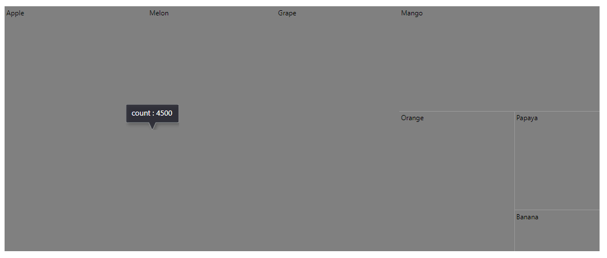
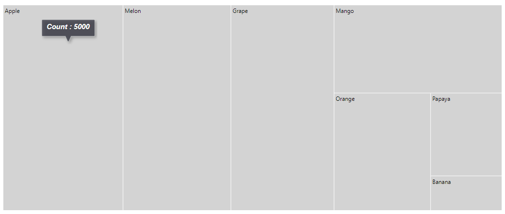
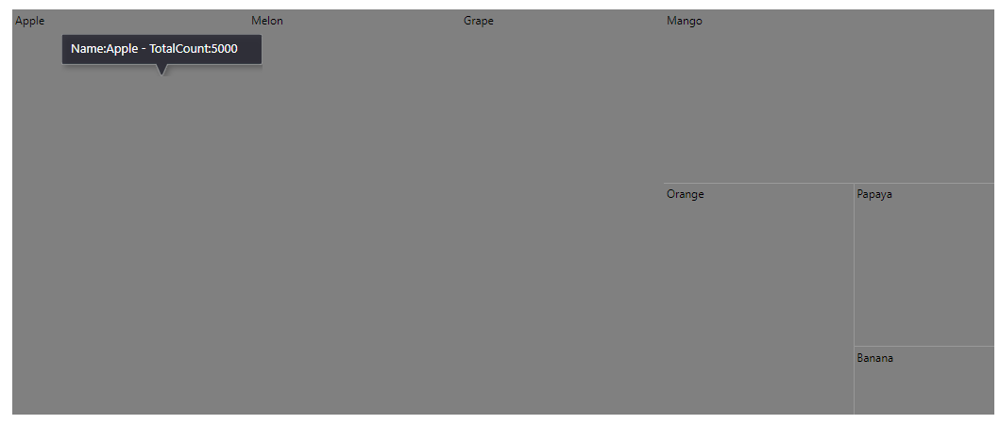

# Tooltip

Tooltip is used to display details about the items in TreeMap when the mouse hovers over the item.

## Default tooltip

By default, the tooltip is not visible. You can enable the tooltip by setting the [`Visible`](https://help.syncfusion.com/cr/aspnetcore-blazor/Syncfusion.Blazor~Syncfusion.Blazor.TreeMap.TreeMapTooltipSettings~Visible.html) property to true in the [`TreeMapTooltipSettings`](https://help.syncfusion.com/cr/aspnetcore-blazor/Syncfusion.Blazor~Syncfusion.Blazor.TreeMap.TreeMapTooltipSettings_members.html) tag.

The following example shows the default tooltip.

```csharp
@using Syncfusion.Blazor.TreeMap

<SfTreeMap WeightValuePath="Count" TValue="Fruit" DataSource="Fruits">
    <TreeMapLeafItemSettings LabelPath="Name"></TreeMapLeafItemSettings>
    <TreeMapTooltipSettings Visible=true></TreeMapTooltipSettings>
</SfTreeMap>

@code {
    public class Fruit
    {
        public string Name;
        public int Count;
    };

    private List<Fruit> Fruits = new List<Fruit> {
        new Fruit { Name="Apple", Count=5000 },
        new Fruit { Name="Mango", Count=3000 },
        new Fruit { Name="Orange", Count=2300 },
        new Fruit { Name="Banana", Count=500 },
        new Fruit { Name="Grape", Count=4300 },
        new Fruit { Name="Papaya", Count=1200 },
        new Fruit { Name="Melon", Count=4500 }
    };
}
```



## Customization

You can customize the TreeMap component tooltip using following properties.
* Fill - Specifies fill color
* Opacity - Specifies opacity of the tooltip
* TreeMapTooltipBorder - Specifies tooltip border color and width
* TreeMapTooltipTextStyle - Specifies tooltip font family, style, weight, color, size

```csharp
@using Syncfusion.Blazor.TreeMap

<SfTreeMap WeightValuePath="Count" TValue="Fruit" DataSource="Fruits">
    <TreeMapLeafItemSettings LabelPath="Name" Fill="lightgray" Gap="2"></TreeMapLeafItemSettings>
    <TreeMapTooltipSettings Visible=true Opacity="0.2">
        <TreeMapTooltipTextStyle FontStyle="italic" FontWeight="bold" Size="15">
        </TreeMapTooltipTextStyle>
    </TreeMapTooltipSettings>
</SfTreeMap>
```

> Refer [code block](#default-tooltip) to know the property value of `Fruits`.



## Formatting tooltip text

By default, the tooltip shows information about weight value of current item. In addition, to show more information in tooltip, [`Format`](https://help.syncfusion.com/cr/aspnetcore-blazor/Syncfusion.Blazor~Syncfusion.Blazor.TreeMap.TreeMapTooltipSettings~Format.html) the tooltip as `${datafield}` from data source.

The following example shows how to format the tooltip.

```csharp
@using Syncfusion.Blazor.TreeMap

<SfTreeMap WeightValuePath="Count" TValue="Fruit" DataSource="Fruits">
    <TreeMapLeafItemSettings LabelPath="Name"></TreeMapLeafItemSettings>
    <TreeMapTooltipSettings Visible=true Format="Name: ${Name} - TotalCount: ${Count}"></TreeMapTooltipSettings>
</SfTreeMap>
```

> Refer [code block](#default-tooltip) to know the property value of `Fruits`.


